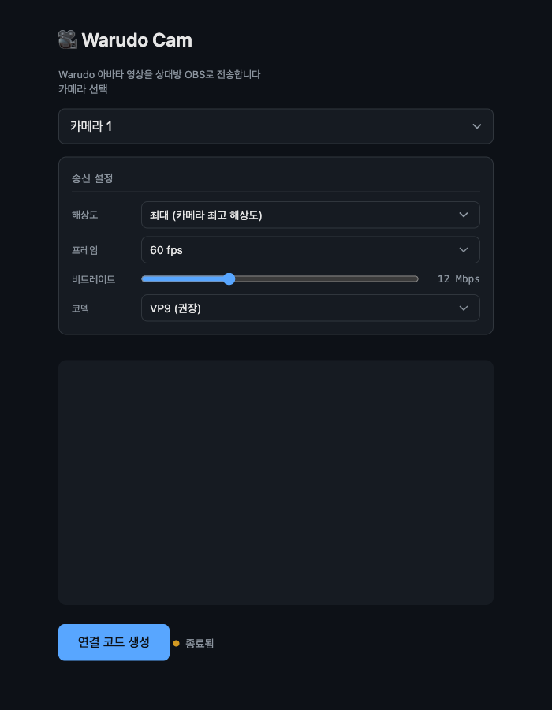
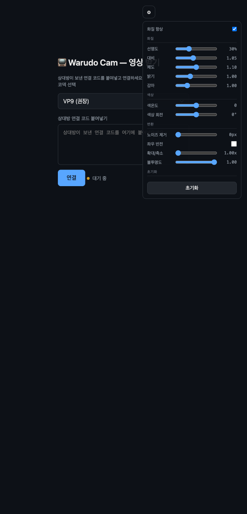

# 🎭 Warudo Cam

SOOP Warudo 스트리머를 위한 P2P 영상 전송 도구

## 📌 소개

SOOP에서 Warudo 아바타를 사용하는 스트리머 두 명이 함께 방송할 때, 상대방의 아바타 영상을 내 OBS로 가져와야 합니다. 보통 Discord 화면 공유를 쓰지만 **720p 제한**, **미국/유럽 서버 경유로 인한 지연**, **화질 저하**가 불가피합니다.

Warudo Cam은 이 문제를 해결합니다:

- **P2P 직접 연결** — 중간 서버 없이 양쪽 PC끼리 직접 영상을 주고받습니다
- **VP9 코덱** — H.264 대비 동일 비트레이트에서 30~50% 더 나은 화질
- **최대 4K 60fps** — Discord의 720p 30fps 한계를 넘어섭니다
- **서버 비용 제로** — GitHub Pages에서 정적 파일로 호스팅, 영상 데이터는 P2P로 전송

## ✨ 주요 기능

- VP9 코덱 기본 지원 (H.264도 선택 가능)
- 해상도 프리셋: 최대(카메라 최고) / 4K / 1440p / 1080p / 720p
- 60fps / 30fps 프레임레이트 선택
- 비트레이트 슬라이더 4~30 Mbps (기본 12 Mbps, 최소 8 Mbps 보장)
- 수신측 실시간 영상 보정 11종 (선명도, 색상, 변환)
- 자동 재연결: ICE restart 최대 5회 → 풀 재연결 최대 3회
- 실시간 통계 모니터링 (비트레이트, 해상도, fps, 패킷 손실, 코덱, RTT)
- OBS 브라우저 소스에 최적화 (연결 후 배경 투명, UI 자동 숨김)

## 🔧 작동 방식

```
송신 (Push)                    수신 (View)
  Warudo                         OBS
    ↓                             ↑
  Virtual Camera                  │
    ↓                             │
  index.html ──── WebRTC P2P ──── view.html
           (STUN/TURN으로 NAT 통과)
```

1. 송신측이 **연결 코드(SDP Offer)** 를 생성합니다
2. 카톡이나 디코로 코드를 상대방에게 전달합니다
3. 수신측이 코드를 붙여넣으면 **응답 코드(SDP Answer)** 가 생성됩니다
4. 응답 코드를 송신측에 돌려주면 P2P 연결이 완료됩니다

> 연결 코드는 LZ-String으로 압축되어 카톡/디코에 붙여넣기 편한 크기입니다.
> STUN 서버(Google, Cloudflare)로 NAT를 통과하고, 안 되면 TURN 서버로 릴레이합니다.

## 🚀 사용법

### 준비물

- Chrome 브라우저 (데스크톱)
- Warudo + Virtual Camera 활성화
- OBS Studio (영상 수신 시)

### 영상 보내기 (Push)



1. **Push 페이지**를 Chrome에서 엽니다
2. 카메라 목록에서 **Warudo Virtual Camera**를 선택합니다
3. 필요하면 **송신 설정**(해상도, fps, 비트레이트, 코덱)을 조정합니다
4. **"연결 코드 생성"** 버튼을 클릭하고, 생성된 코드를 **"복사"** 합니다
5. 카톡이나 디코로 상대방에게 코드를 보냅니다
6. 상대방이 보내준 **응답 코드**를 하단 입력칸에 붙여넣고 **"연결"** 을 클릭합니다
7. 상태 표시가 **"연결됨 ✓"** 로 바뀌면 전송이 시작됩니다

### 영상 받기 (View)



1. **View 페이지**를 Chrome에서 엽니다
2. 상대방이 보낸 **연결 코드**를 입력칸에 붙여넣고 **"연결"** 을 클릭합니다
3. 생성된 **응답 코드**를 복사해서 상대방에게 돌려보냅니다
4. 연결이 완료되면 영상이 전체 화면으로 표시됩니다

### OBS 브라우저 소스 설정

OBS에서 직접 View 페이지를 브라우저 소스로 추가하면 별도 캡처 없이 영상을 받을 수 있습니다.

1. OBS → **소스 추가** → **브라우저**
2. URL에 View 페이지 주소를 입력합니다
3. **너비/높이**를 송신 해상도에 맞춥니다 (예: 1920×1080)
4. **FPS**를 커스텀 프레임레이트로 설정합니다 (60 권장)
5. 연결 과정은 위 View 사용법과 동일합니다
6. 연결이 완료되면 설정 UI가 사라지고 영상만 표시됩니다

> 스크롤바가 보이면 **커스텀 CSS**에 `body { overflow: hidden; }` 를 추가하세요.

## ⚙️ 송신 설정 가이드

Push 페이지의 **송신 설정** 패널에서 영상 품질을 조정합니다.

| 항목 | 선택지 | 기본값 | 권장 |
|------|--------|--------|------|
| **해상도** | 최대 / 4K (3840×2160) / 1440p / 1080p / 720p | 최대 | 1080p 또는 최대 |
| **프레임레이트** | 60fps / 30fps | 60fps | 60fps |
| **비트레이트** | 4~30 Mbps 슬라이더 | 12 Mbps | 8~15 Mbps |
| **코덱** | VP9 / H.264 | VP9 | VP9 |

**참고 사항:**
- **최대 해상도**는 카메라가 지원하는 가장 높은 해상도를 사용합니다 (최대 4096×2160)
- 비트레이트를 4 Mbps 이하로 내려도 **최소 8 Mbps**가 보장됩니다
- 해상도나 fps를 변경하면 카메라가 자동으로 재획득됩니다
- VP9가 안 되는 환경(구형 하드웨어)에서는 H.264를 선택하세요

## 🎨 수신 필터 가이드

View 페이지에서 연결 후 우측 상단의 **⚙️ 톱니바퀴** 아이콘을 클릭하면 영상 보정 패널이 열립니다. 연결 상태에서는 아이콘이 30% 투명도로 표시되며, 마우스를 올리면 나타납니다.

### 화질

| 필터 | 설명 | 범위 | 기본값 |
|------|------|------|--------|
| 선명도 (Sharpness) | SVG convolution 기반 언샤프 마스크 | 0~100% | 30% |
| 대비 (Contrast) | CSS contrast 필터 | 0.80~1.40 | 1.05 |
| 채도 (Saturation) | CSS saturate 필터 | 0.80~1.40 | 1.10 |
| 밝기 (Brightness) | CSS brightness 필터 | 0.50~2.00 | 1.00 |
| 감마 (Gamma) | SVG feComponentTransfer 감마 보정 | 0.50~2.50 | 1.00 |

### 색상

| 필터 | 설명 | 범위 | 기본값 |
|------|------|------|--------|
| 색온도 (Temperature) | SVG feColorMatrix로 Red/Blue 비율 조정 | -100~100 | 0 |
| 색상 회전 (Hue Rotate) | CSS hue-rotate 필터 | -180°~180° | 0° |

### 변환

| 필터 | 설명 | 범위 | 기본값 |
|------|------|------|--------|
| 노이즈 제거 (Denoise) | CSS blur 필터 | 0~3.0px | 0px |
| 좌우 반전 (Flip) | scaleX(-1) 변환 | On / Off | Off |
| 확대/축소 (Zoom) | scale 변환 | 1.00~3.00x | 1.00x |
| 불투명도 (Opacity) | CSS opacity 필터 | 0~1.00 | 1.00 |

> **화질 향상** 토글로 모든 필터를 한번에 끄고 켤 수 있습니다. **초기화** 버튼을 누르면 모든 값이 기본값으로 돌아갑니다.

## 📊 통계 모니터링

연결 후 통계 패널이 자동으로 표시됩니다 (2초 간격 갱신).

- **Push 페이지**: 연결 후 하단에 인라인으로 표시
- **View 페이지**: `S` 키를 눌러 통계 오버레이를 토글합니다

| 항목 | 의미 |
|------|------|
| 비트레이트 | 현재 전송/수신 속도 (Mbps) |
| 해상도 | 실제 전송 중인 영상 해상도 |
| 프레임 | 실시간 fps |
| 패킷 손실 | 전체 패킷 대비 손실률 (%) |
| 코덱 | 현재 사용 중인 코덱 (VP9/H264) |
| 지연 | Round-Trip Time, 왕복 지연 시간 (ms) |

**색상 코드:**
- 🟢 **초록**: 양호 (비트레이트 > 8 Mbps, fps ≥ 28, 패킷 손실 < 1%)
- 🟡 **노랑**: 주의 (비트레이트 4~8 Mbps, fps 20~28, 패킷 손실 1~5%)
- 🔴 **빨강**: 위험 (비트레이트 < 4 Mbps, fps < 20, 패킷 손실 > 5%)

## 🌐 TURN 서버 설정

대부분의 환경에서는 STUN만으로 P2P 연결이 됩니다. 하지만 **Symmetric NAT** 환경(일부 KT, SK, LG U+ 공유기)에서는 P2P가 불가능해서 TURN 서버가 필요합니다.

TURN 서버 설정 가이드: **[docs/coturn-setup.md](docs/coturn-setup.md)**

`rtc.js` 상단의 `ICE_SERVERS` 배열에서 TURN 서버 정보를 수정하세요:

```javascript
var ICE_SERVERS = [
  { urls: 'stun:stun.l.google.com:19302' },
  { urls: 'stun:stun.cloudflare.com:3478' },
  { urls: 'turn:YOUR_TURN_SERVER:443?transport=tcp', username: 'TURN_USER', credential: 'TURN_PASS' }
];
```

> `YOUR_TURN_SERVER`, `TURN_USER`, `TURN_PASS`를 실제 서버 정보로 교체하세요.

## 🛠 기술 스택

| 기술 | 용도 |
|------|------|
| WebRTC | P2P 영상 전송 |
| VP9 / H.264 | 영상 코덱 |
| STUN (Google, Cloudflare) | NAT 통과 |
| TURN (coturn) | Symmetric NAT 릴레이 (선택) |
| LZ-String | SDP 코드 압축 |
| SVG Filters | 수신측 선명도/감마/색온도 보정 |
| GitHub Pages | 정적 호스팅 |

서버 사이드 코드 없음 — 시그널링은 수동 SDP 복사/붙여넣기로 처리합니다.
